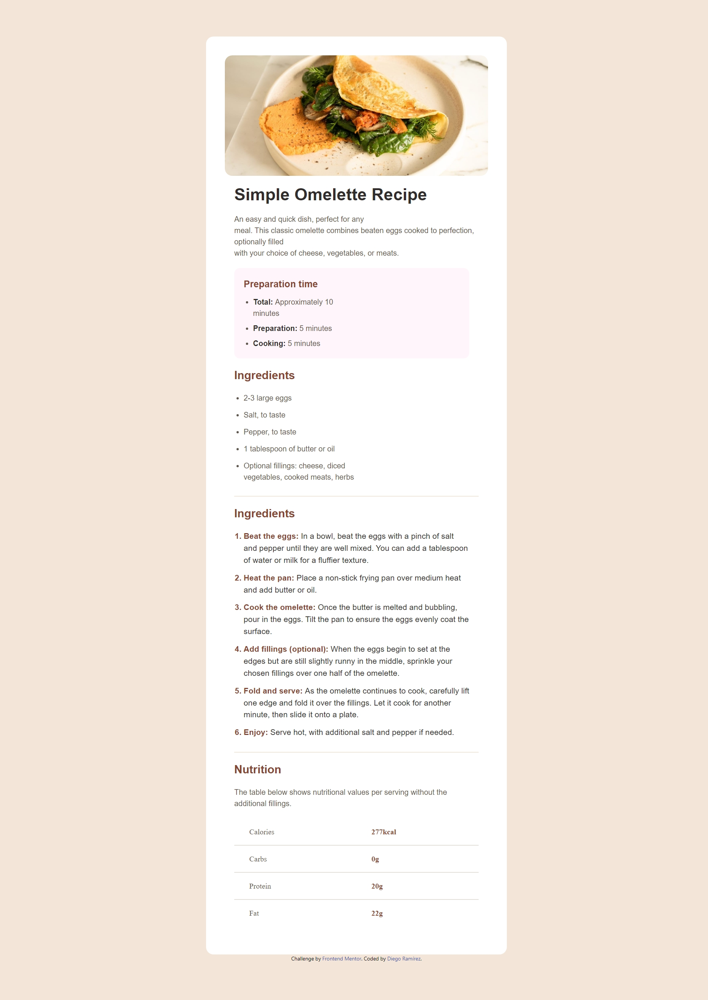

# Frontend Mentor - Recipe page solution

This is a solution to the [Recipe page challenge on Frontend Mentor](https://www.frontendmentor.io/challenges/recipe-page-KiTsR8QQKm). Frontend Mentor challenges help you improve your coding skills by building realistic projects. 

## Table of contents

- [Overview](#overview)
  - [The challenge](#the-challenge)
  - [Screenshot](#screenshot)
  - [Links](#links)
- [My process](#my-process)
  - [Built with](#built-with)
  - [What I learned](#what-i-learned)
  - [Continued development](#continued-development)
- [Author](#author)

## Overview

### Screenshot



### Links

- Solution URL: [github](https://github.com/Diego2Drm/recipe-page-main)
- Live Site URL: [recipe-page-main](https://diego2drm.github.io/recipe-page-main/)

## My process

### Built with

- Semantic HTML5 markup
- Flexbox
- Mobile-first workflow
- Tailwind CSS
- Tailwind custom properties

### What I learned

I learned how to use file fonts.

```html
 <h2 class="text-xl text-Brown-800 font-bold font-Outfit">Preparation time</h2>
```
```css
@font-face {
  font-family: "Young";
  src: url('../assets/fonts/young-serif/YoungSerif-Regular.ttf') format('truetype');
}
@font-face {
  font-family: "Outfit";
  src: url('../assets/fonts/outfit/Outfit-VariableFont_wght.ttf') format('truetype');
}

@import './fonts.css';
```

### Continued development

- Tailwind Css

## Author

- Frontend Mentor - [@Diego2Drm](https://www.frontendmentor.io/profile/Diego2Drm)
